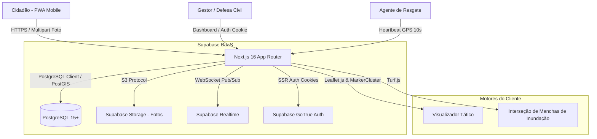
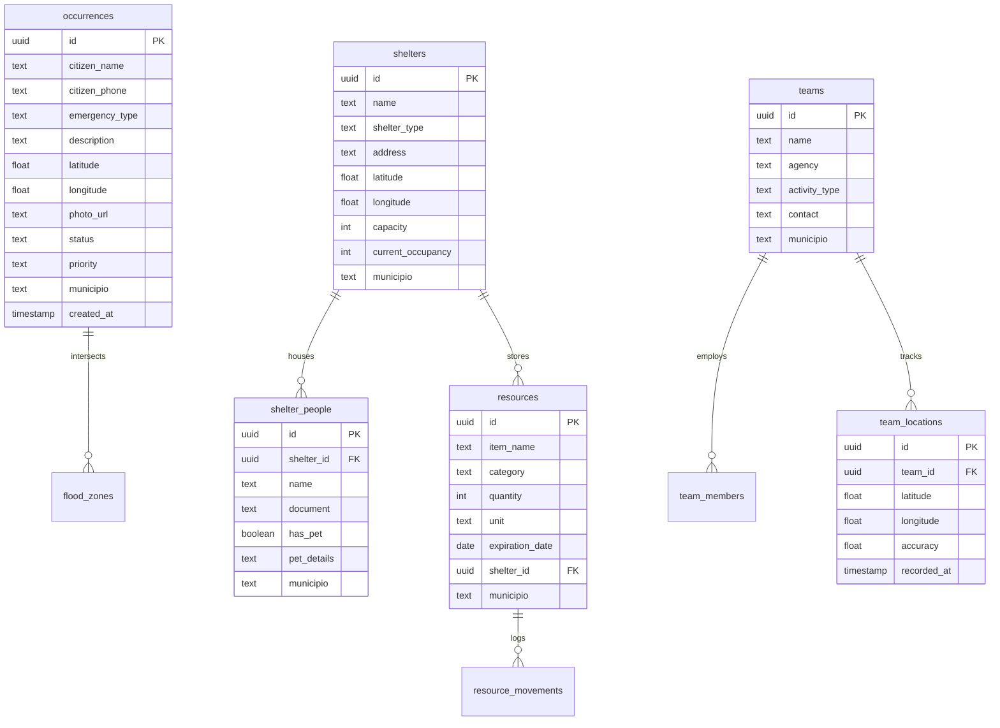

# ARCHITECTURE — Arquitetura do Sistema (GeoAlerta)

## 1. Visão Geral da Arquitetura

O **GeoAlerta** adota uma arquitetura Serverless Full-Stack moderna baseada no **Next.js 16 (App Router)** com Turbopack e **Supabase (PostgreSQL + PostGIS + Auth + Realtime + Storage)**.

---

## 2. Stack Tecnológica Detalhada

| Camada | Tecnologia | Justificativa |
| :--- | :--- | :--- |
| **Framework Web** | Next.js 16.3.5 (Turbopack + React 19) | Renderização híbrida (SSR para painel seguro, Static para PWA rápido), App Router moderno e compilação instantânea. |
| **Linguagem** | TypeScript 5 (Modo Estrito) | Tipagem ponta a ponta e redução de falhas de runtime em produção. |
| **Estilização** | Tailwind CSS 3.4.19 + CSS Variables | Design system rápido, dark mode nativo com tema Slate 950/900 e isolamento de z-index. |
| **Banco de Dados** | PostgreSQL com extensão **PostGIS** | Suporte nativo a cálculos geoespaciais, índices espaciais (GIST) e consultas de proximidade. |
| **Segurança & Dados** | Supabase `@supabase/ssr` + RLS | Autenticação via cookies HTTP-only, proteção de rotas via Middleware e Row Level Security estrito por município. |
| **Mapas e GIS** | Leaflet 1.9.4 + `@turf/turf` 7.4.0 | Renderização vetorial leve de polígonos de risco, clustering de milhares de pontos e geofencing cliente-side. |
| **Ícones** | Lucide React | Biblioteca leve e padronizada de ícones semânticos para interface tática. |

---

## 3. Modelo de Dados e Esquema Relacional

---

## 4. Estratégia de Isolamento e Segurança (RLS)

1. **Escopo por Município:** Toda tabela operacional possui coluna `municipio TEXT NOT NULL DEFAULT 'sa_patrulha'`, garantindo suporte multi-tenant nativo.
2. **Políticas de Row Level Security (RLS):**
   * **Leitura/Criação de Ocorrências:** Cidadãos anônimos podem criar (`INSERT`) ocorrências públicas; apenas operadores autenticados podem atualizar (`UPDATE`/`DELETE`).
   * **Módulos Administrativos:** Rotas de `/painel/*` (Recursos, Abrigos, Equipes, Voluntários) exigem usuário autenticado com sessão válida via `@supabase/ssr`.
3. **Tratamento de Cookies e Middleware:**
   * O middleware intercepta requisições de `/painel` e valida a sessão do usuário. Se não autenticado, redireciona imediatamente para `/login`.

---

## 5. Arquitetura Modular (`src/modules/`)

Para permitir que cada prefeitura adquira ou ative apenas os módulos desejados, o código foi modularizado:
* `src/modules/registry.ts`: Define a lista de módulos ativos e feature flags.
* `src/modules/core/`: Componentes universais (telas, cards, badges, formulários).
* `src/modules/<slug>/`: Cada pasta (`abrigos/`, `equipes/`, `recursos/`, `voluntarios/`) isola a lógica de negócio, chamadas do Supabase e interfaces daquele módulo.
