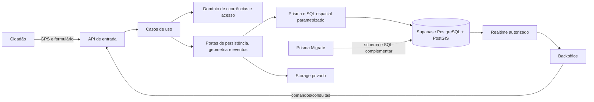

# Arquitetura de software — GeoAlerta Core

**Estado:** proposta técnica vinculada ao [PRD](../PRD.md). Esta pasta documenta arquitetura de software, backend, dados e integrações; não descreve implementação já concluída. O nome anterior `system-design` foi substituído por `architecture` para explicitar essa responsabilidade.

**Documentos relacionados:** [histórias](../requirements.md), [Prisma e migrations](../database/README.md), [testes Playwright](../testing/automated-tests.md) e [execução por agentes](../../../superpowers/plans/2026-09-29-geoalerta-core.md).

## 1. Forma de implantação

Manter um único aplicativo Next.js com API própria (Route Handlers ou funções de servidor adequadas à versão instalada), Prisma ORM/Prisma Migrate, Supabase Auth, PostgreSQL/PostGIS, Storage privado e Realtime autorizado. Não criar um segundo serviço de API, container exclusivo por módulo, fila ou worker para a carga de planejamento de 100 novas ocorrências/hora. Isso reduz pontos de operação sem impedir extração posterior.

O mapa e a geolocalização continuam no navegador porque usam APIs de dispositivo e Leaflet. Comandos operacionais entram por uma fronteira de servidor; o banco aplica restrições adicionais. A confirmação ao cidadão só ocorre depois de persistir ocorrência, classificação e protocolo.

## 2. Limites hexagonais

| Unidade | Responsabilidade | Pode depender de |
|---|---|---|
| Domínio `occurrences` | Ocorrência, prioridade, transições, invariantes e eventos | Tipos e funções puras; não depende de React, Next.js, Prisma ou Supabase |
| Domínio `access` | Capacidades, grupo e estado do usuário | Tipos e funções puras |
| Aplicação | Casos de uso: abrir, consultar, editar, transicionar, excluir logicamente, exportar, administrar | Domínio e interfaces de portas |
| Portas | Contratos de repositório, unidade de trabalho, geofencing, Storage, relógio e publicação | Tipos de domínio |
| Adaptadores | API HTTP, Prisma/PostGIS, Auth, Storage, Realtime e CSV | Portas e bibliotecas concretas |
| Interface | Formulário público, dashboard, lista, detalhe, perfil, administração e mapa | Contratos da API e componentes visuais |

O domínio não importa objetos `Request`, clientes Prisma/Supabase, hooks React nem componentes Leaflet. Cada caso de uso verifica autorização e precondições antes de mutar. A transação de banco preserva ocorrência, prioridade e histórico como uma unidade. A arquitetura hexagonal é uma regra para dependências e testes, não uma exigência de criar um pacote ou serviço por unidade.

## 3. Contratos de operações

| Operação | Entrada e saída principais | Autorização |
|---|---|---|
| Abrir ocorrência | Tipo, descrição, dados do cidadão, coordenadas/precisão, foto opcional e chave de idempotência → protocolo | Pública, com validação e proteção de abuso |
| Listar/mapear | Filtros, cursor/página, ordenação e limites espaciais/temporais → projeções paginadas | Papel e grupos; dados pessoais mínimos |
| Ler detalhe | ID → ocorrência, histórico, foto autorizada e campos permitidos | Papel e grupo; mascaramento conforme capacidade |
| Criar/editar/transicionar | Comando, versão esperada e motivo quando aplicável → nova versão | Operador, gestor ou administrador conforme capacidade |
| Excluir/restaurar | ID e justificativa → estado lógico e evento | Administrador |
| Perfil | Dados próprios → perfil atualizado | Próprio usuário ativo |
| Usuários/regras/zonas | Comandos administrativos → estado e auditoria | Administrador |
| Exportar CSV | Mesmo filtro da lista → arquivo completo autorizado | Gestor ou administrador |

Leituras de lista jamais usam `select *` sem limite. Ordenação usa uma lista permitida de campos; filtro, tamanho de página e área do mapa têm limites definidos na API. CSV aplica o mesmo predicado de autorização da lista e pagina internamente. Nenhuma rota confia em papel, grupo ou prioridade enviado pelo navegador.

## 4. Persistência e consistência

- `occurrences`: ID, protocolo único, tipo, descrição, localização geográfica obrigatória, precisão, prioridade, zona que motivou prioridade, status interno, grupo responsável, versão, timestamps e marca de exclusão lógica.
- `occurrence_events`: evento imutável de criação, edição, transição, atribuição, exclusão ou restauração, com ator, instante, motivo e alterações relevantes.
- `risk_zones`: geometria válida, tipo, estado ativo/inativo, vigência e versão. Interseção oficial ocorre em PostGIS com índice espacial; a mancha visual gerada no navegador não é fonte de classificação.
- `admin_profiles`, `groups`, `user_group_memberships`, `user_preferences`, `status_transitions` e `audit_events`: identidade administrativa, escopo, apresentação e governança.
- `status_presentations`: rótulo e ordem de exibição dos cinco códigos internos fixos; alterar apresentação não modifica os códigos nem eventos históricos.
- `idempotency_keys`: chave e resposta associada à tentativa pública; repetição devolve o protocolo original.
- `occurrence_private_data`: nome, contato, referência de foto e campos privados separados da projeção operacional; Consulta não recebe acesso, inclusive no banco.
- `occurrence_alerts`: feed mínimo com ID do evento, ID da ocorrência, grupo, prioridade, status e instante, sem descrição livre, nome, contato, foto ou coordenadas exatas; é a única tabela Core publicada para alertas Realtime.

Índices são desenhados para consultas reais: data/status/prioridade/grupo das ocorrências, índice espacial para pontos e polígonos, e chaves únicas de protocolo e idempotência. A migração deve ser aditiva, reproduzível em banco vazio e testada com dados existentes. Valores legados conhecidos (`Aberto`, `Em Atendimento`, `Resolvido`, `Recusado`) recebem mapeamento explícito; valores desconhecidos são identificados no relatório de pré-migração e resolvidos antes de impor as novas restrições.

Criação manual registra ator e segue a validação de GPS e a triagem espacial da abertura pública. Edição e demais mutações usam versão esperada para detectar alterações concorrentes. Operações que afetam várias tabelas, como transição com evento de auditoria, são transacionais. Falha parcial retorna erro recuperável, sem confirmação enganosa ao usuário.

Prisma mantém o modelo relacional e o histórico de migrations. PostGIS, RLS, grants, funções e publicação Realtime são SQL complementar nas mesmas migrations. Geometria usa SRID 4326, ordem longitude/latitude e interseção que inclui a borda; zonas inativas, fora da vigência ou com geometria inválida não participam da classificação. A classificação guarda IDs/versões das zonas correspondentes para explicar sobreposições e alterações posteriores. O [planejamento de banco](../database/README.md) detalha baseline e permissões de conexão.

## 5. Segurança e privacidade

1. Auth identifica o operador; autorização combina **papel, grupo e estado ativo** em cada comando e leitura. Bloqueio de conta é consultado no lado confiável também para sessões já emitidas.
2. RLS e concessões do banco expressam o mesmo escopo da aplicação. Uma conta autenticada sem vínculo autorizado não ganha leitura geral.
3. Fotos de ocorrência usam bucket privado e acesso temporário autorizado. URLs públicas permanentes e dados pessoais não entram em eventos Realtime.
4. A entrada anônima aplica limite de tamanho, formatos aceitos, proteção contra abuso e idempotência. Coordenadas devem ser finitas e dentro dos intervalos geográficos válidos; a origem nativa é exigida pela interface, mas não pode ser provada pelo servidor em um cliente anônimo.
5. Logs e telemetria evitam nome, contato, foto e coordenadas exatas. Exportação CSV protege células que poderiam ser interpretadas como fórmula.
6. O cliente nunca recebe chave `service_role`/secret. Toda função privilegiada tem escopo e validação explícitos.
7. Prisma não herda o JWT de uma sessão Supabase automaticamente. Cada transação protegida instala contexto de identidade verificada e usa uma role sem `BYPASSRLS`, sem propriedade das tabelas. O contexto é local à transação e não pode vazar entre conexões reutilizadas. Credenciais de migration não são as de execução da aplicação.
8. RLS restringe linhas, não mascara campos de uma linha. Dados pessoais e o feed de alertas ficam separados; grants/RLS próprios impedem acesso direto do papel Consulta a dados privados. Operações passam pela API; leitura Realtime é autorizada no banco.
9. Roles de execução `geoalerta_runtime` e `geoalerta_ingest` são restritas ao servidor. `anon`/`authenticated` não recebem escrita nas tabelas Core; `authenticated` lê somente o feed de alertas autorizado pelo RLS. A autorização dos casos de uso não pode ser contornada por escrita direta na Data API.

## 6. Tempo real, capacidade e falhas

Alertas in-app são derivados de ocorrências **já confirmadas**, usando o feed `occurrence_alerts` gravado na mesma transação. O canal entrega apenas identificador, grupo e informações operacionais mínimas; o painel busca detalhe autorizado quando necessário. Reconexão recarrega a visão corrente, pois eventos podem ter sido perdidos. O painel não mantém todos os registros em memória para renderizar mapa ou contagens. Conta suspensa perde autorização de leitura do feed; falha de autorização encerra a assinatura na interface.

O volume de 100 novas ocorrências/hora, 10 operadores e 50 mil registros históricos é um **cenário de teste**, não capacidade demonstrada. Testar rajadas, fotografias, Realtime, lista, mapa e CSV juntos. Medir p95, taxa de erro, atraso de alerta, tamanho das consultas e crescimento do banco. Se uma tarefa secundária precisar de repetição independente, introduzir fila e worker nessa tarefa, mantendo a gravação/triagem crítica síncrona e transacional.

## 7. Features legadas desativadas

Recursos/estoques, abrigos, equipes/GPS e voluntários permanecem no repositório e no banco. Nesta release, remover suas entradas de navegação, bloquear rotas diretas e operações, encerrar assinaturas e não iniciar transmissão de GPS. A desativação é coberta por teste de rota e permissão; ocultar menu isoladamente não basta. Não executar migração destrutiva dessas tabelas.

## 8. Regras de desenvolvimento

- **Histórias → specs → testes → código:** toda fatia começa com história e cenários Given/When/Then no PRD, ganha spec de contratos e dados, depois testes automatizados; a implementação satisfaz esses testes.
- **Teste no limite certo:** domínio com testes unitários; API e RLS com integração; fluxos principais com testes de ponta a ponta; migração e carga com cenários próprios.
- **Arquivos focados:** um módulo deve expor interfaces claras. Componentes de tela não decidem prioridade, transição ou autorização.
- **Mudanças versionadas:** Prisma Migrate organiza schema e SQL complementar em um histórico único; nenhuma alteração manual no banco é fonte exclusiva de verdade. Erros são retornados de forma estável e observável.
- **Documentação:** cada pasta documental e nova unidade relevante terá `README.md` curto com propósito, interface, dependências e comandos de teste. Atualizar os índices quando o desenho mudar.
- **Execução por agentes:** implementar tarefas do plano com um agente responsável e um revisor independente; interfaces compartilhadas são definidas antes das tarefas dependentes. Não iniciar desenvolvimento nesta revisão documental.
- **Governança:** a IA pode escrever e testar localmente. Apenas o usuário revisa, faz commit, push, merge e deploy, conforme `AGENTS.md`.

## 9. Ponto de atenção antes da implementação

`AGENTS.md` exige `.env` em `sistema/`, mas o checkout atual tem `package.json` na raiz `GeoAlerta/` e não possui a pasta `sistema/`. A decisão de planejamento é manter os caminhos de código da raiz e carregar explicitamente `sistema/.env` nos comandos locais de Next.js, Prisma e Playwright. A tarefa de fundação cria o carregador comum; nenhuma credencial é criada, movida ou versionada implicitamente. CI usa variáveis injetadas, sem criar um segundo arquivo de ambiente local.

Os guias locais de Next.js em `node_modules/next/dist/docs/` não estão disponíveis neste checkout sem dependências instaladas. Os agentes deverão instalar as dependências conforme o lockfile e ler os guias da versão efetiva antes de escrever código Next.js.

## 10. Limites e contratos propostos para implementação

Os valores abaixo são decisões técnicas propostas nesta revisão, sujeitas à revisão do plano; não são capacidade medida nem recursos já implementados.

| Entrada/consulta | Limite e comportamento |
|---|---|
| Formulário | Nome 1–120 caracteres, contato 1–40, descrição 1–2.000, tipo 1–80; validar após remover espaços nas extremidades. |
| Localização | Latitude finita entre −90 e 90, longitude finita entre −180 e 180, precisão finita ≥ 0; captura nativa também na criação manual. |
| Foto | JPEG/PNG/WebP até 5 MiB, com conteúdo verificado; token temporário vinculado à tentativa, sem associação arbitrária a outra ocorrência. URL de leitura autorizada expira em 60 segundos. |
| Abuso público | 20 novas tentativas/minuto por origem confiável de rede, com contador compartilhado; replay idempotente não é nova tentativa. Não confiar em header de IP arbitrário. |
| Lista | Página padrão 1, tamanho padrão 50 e máximo 100; ordenação permitida por `createdAt`, `priority` ou `status`, padrão `createdAt desc`, desempate por ID. |
| Mapa | Recorte padrão de 7 dias, máximo de 31 dias e até 1.000 pontos; resposta indica limitação e contagens cobrem todo o recorte autorizado. |
| CSV | Percorrer todas as páginas do conjunto filtrado autorizado, sem aplicar o limite de pontos do mapa; UTF-8 e tratamento de fórmulas/escape de células. |

API Core em `/api/core/`: entrada pública em `public/occurrences` e `public/photos`; backoffice em `occurrences`, `occurrences/[id]`, `occurrences/[id]/photo`, `occurrences/export`, `dashboard`, `profile` e `admin/{users,groups,transitions,zones}`. O [plano](../../../superpowers/plans/2026-09-29-geoalerta-core.md#contratos-compartilhados-decididos-neste-plano) fixa os DTOs e interfaces de cada tarefa.

`POST public/occurrences` exige `Idempotency-Key`; criação retorna `201`, replay do mesmo corpo `200`, chave reutilizada com corpo diferente `409`. APIs protegidas usam `401` sem identidade, `403` sem capacidade, `404` para ID fora do escopo, `409` para conflito de versão, `422` para entrada inválida e `429` para abuso. Erro JSON tem formato `{ error: { code: string, message: string } }`. Mutações recebem `{ expectedVersion, command }`; versões começam em 1 e incrementam uma vez por alteração bem-sucedida.
